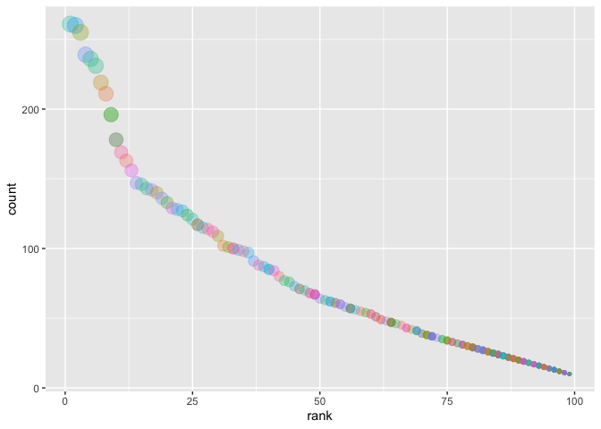

P8105 Data Science I - Homework 2
================
Kevin S.Wongsodirdjo UNI: ksw2137
9/24/2019

# Introduction

R Markdown document for P8105 homework 2. Code chunk below shows that we
are loading the required packages in order to manipulate the imported
data.

``` r
# Loads the necessary packages
Packages <- c("tidyverse", "dplyr", "readxl")
invisible(lapply(Packages, library, character.only = TRUE))
```

# Problem 1 - Data Import for Mr. Trash Wheel, 2017 Precipitation, & 2018 Precipitation and Data Clean-up

We are loading datasets from the Healthy Harbor Water Wheel dataset,
particularly from the sheets: “Mr. Trash Wheel”, “2018 Precipitation”,
and “2017 Precipitation”. While the Mr. Trash Wheel dataset is generally
“tidy”, we will modify these further to make it easier to work with the
data. Dataset for precipitation from 2017 and 2018 were on separate
sheets and needed to be merged since we would like a combined dataset.

``` r
# Import excel sheet and piping to clean data for Mr. Trash Wheel
trash_wheel_data <- 
  read_excel("./data/trash_wheel/HealthyHarborWaterWheelTotals2018-7-28.xlsx",
             sheet = "Mr. Trash Wheel",                             # Specifies which sheet to read
             range = "A2:N336") %>%                                 # Specifies the cells imported
  janitor::clean_names() %>%                                        # renames column titles as x_y and lowercases
  drop_na(year) %>%                                                 # drops any rows containing NA in "year" column
  mutate(
    date = format(date, format = "%d"),                             # Changes the date format from %y%m%d to %d
    sports_balls = round(sports_balls, 0),                          # Rounds the numbers in sports_balls to integers
    sports_balls = as.integer(sports_balls),                        # Converts type from double to integers
    month = str_to_lower(month)) %>%                                # Makes months to have lowercases
  select(dumpster, year, month, everything())                       # Re-arranges the column to be "tidier"


# Reads the 2017 precipitation data
precip2017_data <- 
  read_excel("./data/trash_wheel/HealthyHarborWaterWheelTotals2018-7-28.xlsx", 
             sheet = "2017 Precipitation",                          # Specifies the sheet
             range = "A2:B14") %>%                                  # Specifies range of cells to be read
  janitor::clean_names() %>%                                        # turns column names to lowercases
  mutate(year = "2017") %>%                                         # Adds year column
  select(year, everything())                                        # Re-arrange so year is 1st column
  

# Reads the 2018 precipitation data    
precip2018_data <- 
  read_excel("./data/trash_wheel/HealthyHarborWaterWheelTotals2018-7-28.xlsx", 
             sheet = "2018 Precipitation",                          # Specifies the sheet
             range = "A2:B14") %>%                                  # Specifies range of cells to be read
  janitor::clean_names() %>%                                        # turns column names to lowercases
  mutate(year = "2018") %>%                                         # Adds year column
  select(year, everything()) %>%                                    # Re-arrange so year is 1st column 
  drop_na(total)                                                    # drops blank cells in "total" column


# New dataframe that merged precip2017 and precip2018 by year, then month, then "total". 
merged_precip20178_data <- 
  full_join(precip2017_data, precip2018_data, by = c("year", "month", "total")) %>% 
  mutate(month = str_to_lower(month.name[month])) %>%               # changes month from "1" to "january" and so on
  rename(monthly_precip = total)                                    # renames the total column to monthly_precip
```

Data from Mr. Trash Wheel was obtained from Healthy Harbor Water Wheel’s
website and while it’s not necessary to include the It contains a total
of 14 variables (including dumpster \#) containing 285 observations
each. Examples of particularly key variables included are
`volume_cubic_yards` (trash volume in cubic yards) and unique types of
trash such as `cigarette_butts` or `plastic_bottles`. Interestingly,
there were also `sports_balls` included, which has a total median of 8
balls per dumpster.

The precipitation data was less interesting; there were a total of 19
observations corresponding to each month (Jan 2017 - Jul 2018) and its
precipitate in inches, which is under the `monthly_precip` column. The
`year` identifier was added and merged as it was not included in the
original. Total measured precipitation for 2018 was 23.5 inches, taking
into account that the range of 2018 data was from Jan 2018 - Jul 2018.

# Problem 2

Making a merged data between polls, unemployment, and S\&P 500 Index
data obtained from FiveThirtyEight, a website that focuses on
graphs.

``` r
# Importing polls data, splot the y/m/d date into individual columns. Also changed month from numeric to 
# three-letter form
pols_month_data <- 
  read_csv("./data/538/pols-month.csv") %>% 
  janitor::clean_names() %>% 
  separate(col = mon, into = c("year", "month", "date"), "-") %>% 
  mutate(month = str_to_lower(month.abb[as.numeric(month)]),
         prez = prez_gop - prez_dem,
         prez = factor(prez, labels = c("dem", "gop", "gop"))) %>% 
  select(year, month, prez, everything(), -date, -prez_gop, -prez_dem)
  

# Loads snp data, separate m/d/y into individual columns
snp_data <- 
  read_csv("./data/538/snp.csv") %>% 
  janitor::clean_names() %>% 
  separate(col = date, into = c("month", "date", "year"), "/") %>%
  mutate(month = as.numeric(month)) %>% 
  select(year, month, close) %>% 
  arrange(year, month) %>% 
  mutate(month = str_to_lower(month.abb[month]))

# Importing unemployment data and then turn it from wide to long format.
unemployment_data <- 
  read_csv("./data/538/unemployment.csv") %>% 
  janitor::clean_names() %>% 
  pivot_longer(
    jan:dec,
    names_to = "month",
    values_to = "unemp_count")


# Merging the above dataframes by using pols_month_data as the reference.
merged_538_data <-
  left_join(pols_month_data, snp_data, by = c("year", "month")) %>% 
  mutate(year = as.numeric(year)) %>% 
  left_join(unemployment_data, by = c("year", "month")) %>% 
  rename(snp_close = close)
```

Write a short paragraph about these datasets. Explain briefly what each
dataset contained, and describe the resulting dataset (e.g. give the
dimension, range of years, and names of key variables).

# Problem 3

We are using data from NYC Open on baby names’ popularity and will
create a table that shows “popularity ranking”.

Issues with the data:

  - Inconsistent categorization naming:
      - ASIAN AND PACIFIC ISLANDER vs. ASIAN AND PACI
      - BLACK NON HISPANIC vs. BLACK NON HISP
      - WHITE NON HISPANIC vs. WHITE NON HISP
  - Case structure of the names changed between 2012 - 2013 from
    “UPPERCASE” to “Name”
  - Many duplicated rows were spotted

<!-- end list -->

``` r
baby_names_data <-
  read_csv("./data/baby_names/Popular_Baby_Names.csv") %>% 
  janitor::clean_names() %>% 
  mutate(childs_first_name = str_to_lower(childs_first_name),
         ethnicity = str_to_lower(ethnicity),
         gender = str_to_lower(gender)) %>% 
  distinct(year_of_birth, gender, ethnicity, childs_first_name, count, rank, .keep_all = TRUE) %>%
  mutate(ethnicity = str_replace(ethnicity, "asian and paci(?!fic islander)", "asian and pacific islander"),
         ethnicity = str_replace(ethnicity, "black non hisp(?!anic)", "black non hispanic"),
         ethnicity = str_replace(ethnicity, "white non hisp(?!anic)", "white non hispanic"))
                                  

olivia_fem_rank_annual <- baby_names_data %>% 
  filter(childs_first_name == "olivia", gender == "female") %>% 
  select(-gender, -childs_first_name, -count) %>% 
  pivot_wider(names_from = year_of_birth,
              values_from = rank) %>% 
  select(ethnicity, "2011", "2012", "2013", "2014", "2015", "2016")


male_rank1_annual <- baby_names_data %>% 
  filter(rank == 1, gender == "male") %>% 
  select(-gender, -rank, -count) %>% 
  pivot_wider(names_from = year_of_birth,
              values_from = childs_first_name) %>% 
  select(ethnicity, "2011", "2012", "2013", "2014", "2015", "2016")


top100_whitemale_2016 <- baby_names_data %>% 
  filter(year_of_birth == 2016, gender == "male", ethnicity == "white non hispanic") %>%
  ggplot(aes(x = rank, y = count, color = childs_first_name)) +
  geom_point(aes(size = count), alpha = 0.3) +
  theme(legend.position = "none")

top100_whitemale_2016
```

<!-- -->

Finally, for male, white non-hispanic children born in 2016, produce a
scatter plot showing the number of children with a name (y axis) against
the rank in popularity of that name (x axis).
